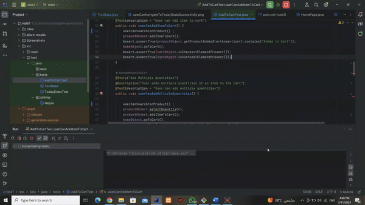

# VOIS Automation Task Assessment

## Selenium/Java/TestNG/Maven/Allure reports

This Selenium automation framework is designed to automate tasks on various sections of Amazon's website.

## Test Scenarios

### Scenario 1: Search and Add Car Accessories

- Open [Amazon](https://www.amazon.com/)
- Search for "car accessories"
- Select the first item
- Add the item to the cart
- Verify that the item is added successfully

### Scenario 2: Navigate Today's Deals

- Open Today's Deals section
- Apply filters:
  - Categories: Headphones, Grocery
  - Discount: 10% off or more
- Navigate to the fourth page
- Select any item and add it to the cart

## Features

- Built using Maven for easy dependency management and build automation
- Implements Selenium WebDriver for browser automation
- Utilizes TestNG for test execution and reporting
- Follows Java 8 coding standards
- Includes Allure reports for comprehensive test reporting
- Integration of `takescreenshotclass` for capturing screenshots on test failure

